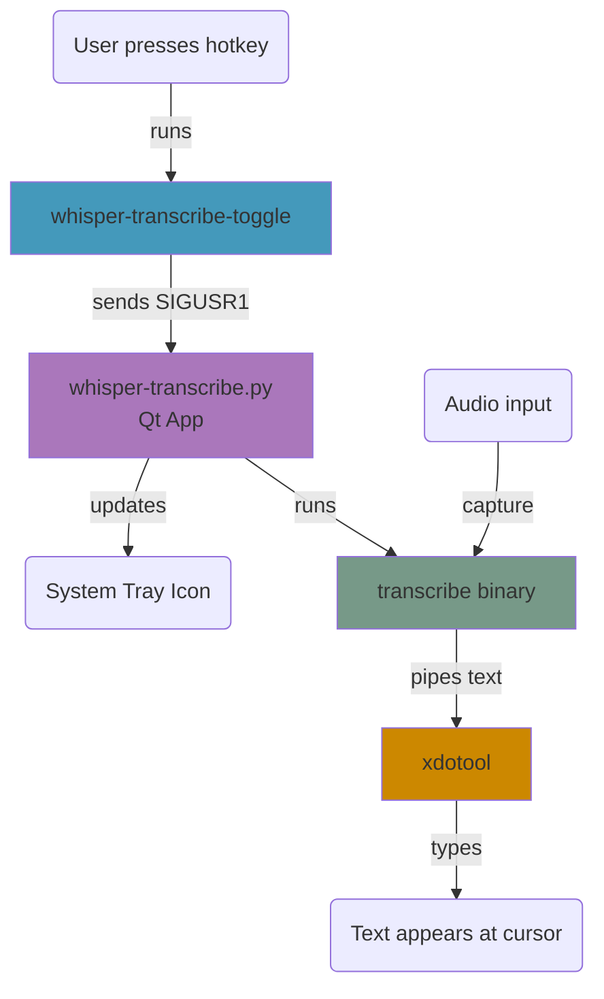

# Whisper Transcribe

A voice-to-text transcription tool that allows you (or me, anyway) to use voice
like a keyboard in any text field. This is my own variant of
[nerd-dictation](https://github.com/ideasman42/nerd-dictation), using
[whisper.cpp](https://github.com/ggml-org/whisper.cpp) for transcription. The
main reason I'm not using nerd-dictation is that I want capitalization and
punctuation in transcribed text. The basic flow is:

- Run the background app (use the .desktop file in your autostart directory to
  make it always run). This will put an icon in your system tray that allows you
  to toggle transcription on or off.
- Turn on transcription with the icon, or by configuring a keyboard shortcut. I
  use ctrl+alt+m.
- Put your cursor anywhere and speak to type. You can of course continue to type
  with your regular keyboard as well. The voice keyboard should _never_ enter
  newline characters, so as to avoid accidentally executing an action on your
  behalf.
- Turn off transcription whenever you want to with the system tray icon or hotkey.

## Dependencies

### System packages
```bash
sudo apt update && sudo apt install libsdl2-dev xdotool
```

### Python packages
```bash
pip install PyQt5
```

## Build Instructions

1. **Clone whisper.cpp and build the required libraries:**
   ```bash
   cd /where/you/like/to/clone/repos
   gh repo clone ggml-org/whisper.cpp
   cd whisper.cpp

   cmake -B build \
     -DWHISPER_SDL2=ON \
     -DGGML_CUDA=ON \
     -DWHISPER_BUILD_EXAMPLES=OFF \
     -DWHISPER_BUILD_TESTS=OFF \
     -DWHISPER_BUILD_SERVER=OFF

   cmake --build build --target whisper common common-sdl --config Release
   ```
   Remove `-DGGML_CUDA=ON` if you don't have (or don't want to use) a GPU.

2. **Download transcription and voice activity detection models:**
   From the root of your whisper.cpp repo:
   ```bash
   sh ./models/download-ggml-model.sh base.en
   sh ./models/download-vad-model.sh silero-v5.1.2
   ```

3. **Clone this repo in your `~/.config`:**
   ```bash
   cd $HOME/.config
   gh repo clone geraschenko/whisper-transcribe
   ```

4. **Symlink models to current directory:**
   ```bash
   ln -s /path/to/whisper.cpp/models models
   ```

5. **Build the transcribe binary:**
   Update WHISPER_CPP_DIR in the Makefile to point to your `/path/to/whisper.cpp` and run make from this directory:
   ```bash
   make
   ```

## Installation

1. **Set up autostart (choose one option):**
   
   **Option A: Copy the desktop file**
   ```bash
   cp whisper-transcribe.desktop ~/.config/autostart/
   ```
   
   **Option B: Create a symlink**
   ```bash
   ln -s "$(pwd)/whisper-transcribe.desktop" ~/.config/autostart/
   ```

2. **Configure hotkey:**
   - Open Settings → Keyboard → Keyboard Shortcuts
   - Add a new custom shortcut:
     - **Name**: Whisper Transcribe Toggle
     - **Command**: `$HOME/.config/whisper-transcribe/whisper-transcribe-toggle`
     - **Shortcut**: Ctrl+Alt+M (or your preferred combination)

## Usage

### Starting the application
The application will start automatically on login (if you set up autostart). To start manually:
```bash
python3 whisper-transcribe.py
```

### Using transcription
1. **System tray icon**: Look for the whisper-transcribe icon in your system tray
   -  **Inactive**: Transcription is off, ready to start
   -  **Active**: Transcription is on and will enter text
     whenever there's a short gap in speech.

2. **Toggle transcription**:
   - Use your configured hotkey (e.g., Ctrl+Alt+M)
   - Or left-click the system tray icon
   - Or right-click the tray icon → "Toggle Transcription"

3. **Speak**: When active (red), speak and text will appear where your cursor is.

4. **Stop**: Press the hotkey again or click the tray icon to stop.

5. **Select audio input device**: Your choice is remembered in
   `~/.config/whisper-transcribe/config.json`. If your preferred device is
   available, we use it. Otherwise, the default device is used.

### Exiting the application
- Right-click the system tray icon → "Quit"
- Or press Ctrl+C in the terminal if running manually

## How it works



The transcription work is done by the `transcribe` binary, which captures audio
from a given input device and outputs text to stdout. It starts collecting audio
when it detects speech, and continues collecting until there's a 500ms interval
with no speech, at which point it transcribes everything it's collected and
sends the text to stdout.

The `whisper-transcribe.py` Qt app handles the system tray icon. It's also
responsible for starting and stopping the `transcribe` binary and piping the
output text to `xdotool`, which "types" the text in as if it were input by a
keyboard.

The `whisper-transcribe-toggle` script controls `whisper-transcribe.py` by
sending it SIGUSR1.

## Troubleshooting

### Hotkey not working
- Check if another application is using the same hotkey
- Verify the toggle script path in keyboard shortcut settings
- Test the toggle script manually: `./whisper-transcribe-toggle`

### No system tray icon
- Ensure your desktop environment supports system tray
- Install GNOME Extensions if using vanilla GNOME
- Check if PyQt5 is properly installed

### Transcription not working
- Verify the transcribe binary exists: `ls build/transcribe`
- Check if xdotool is installed: `which xdotool`
- Test the binary manually: `./build/transcribe`

### Permission issues
- Ensure scripts are executable: `chmod +x whisper-transcribe-toggle whisper-transcribe.py`
- Check file paths in desktop file and scripts

## Development

The application uses:
- **Qt5** for system tray and GUI components
- **Unix signals** (SIGUSR1) for inter-process communication
- **Subprocess management** for the transcription pipeline
- **Process groups** for clean shutdown of all child processes
